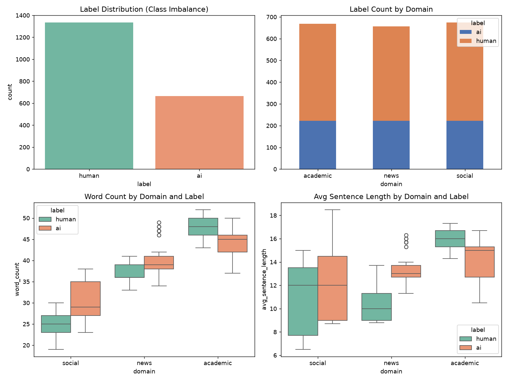
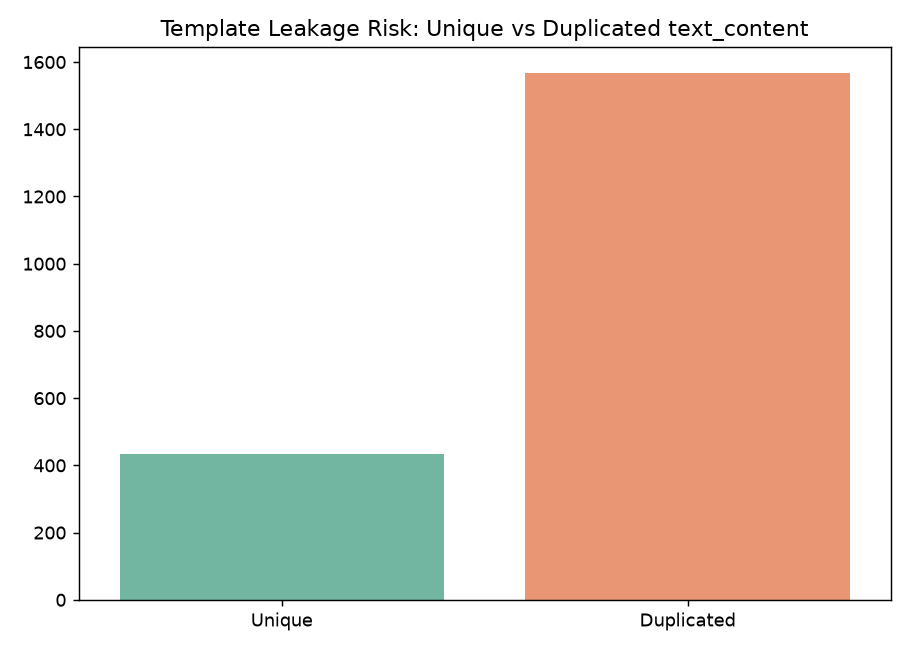
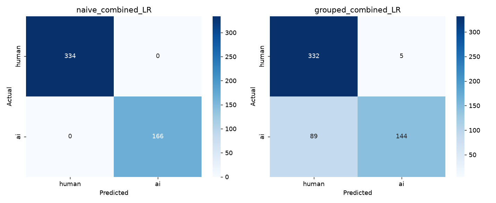
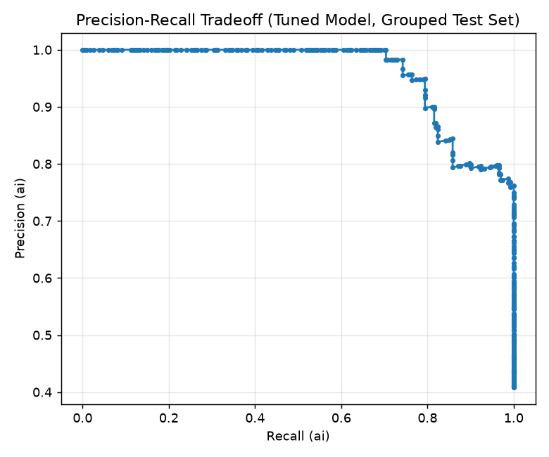
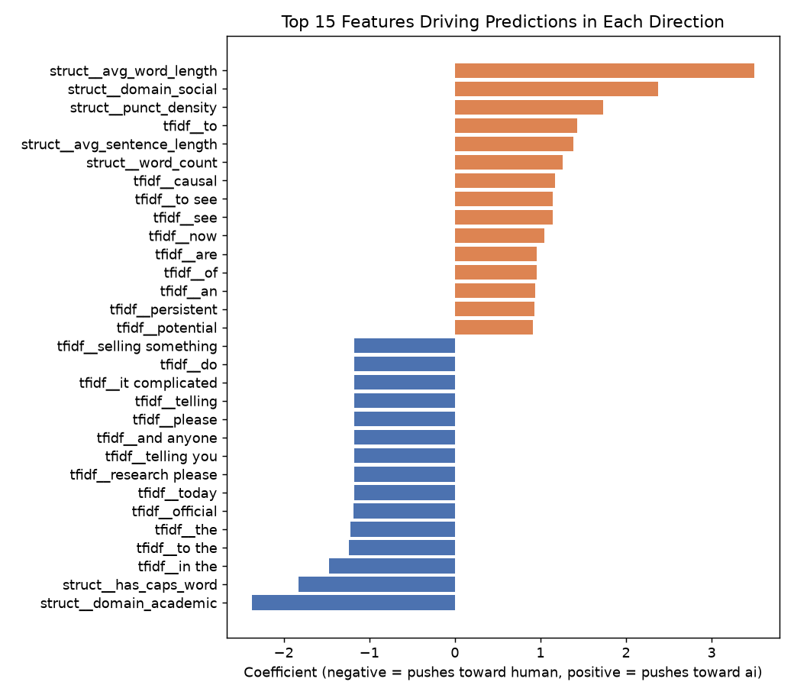

# AI vs Human Text Classifier — Final Report

## 1. Executive Summary

This project builds a binary classifier to detect AI-generated vs human-written
text across three content domains (social media, news, academic) for a
content platform that needs to flag machine-generated submissions before
publication without falsely penalizing genuine human writers.

The final model is a **Logistic Regression classifier on TF-IDF (1–2 gram)
text features combined with nine hand-engineered stylistic/structural
features**, selected after comparing against Naive Bayes, Linear SVM, Random
Forest, Gradient Boosting, and sentence-embedding-based models.

The most important finding of this project is methodological, not just a
performance number: **single train/test split evaluation produced
misleadingly optimistic results (97–100% precision)**. Rigorous grouped
5-fold cross-validation — which respects the dataset's underlying template
structure — reveals the **true, honest expected precision is closer to
0.70**, with substantial fold-to-fold variance. This gap, and why it exists,
is the central finding of the analysis.

## 2. Business Problem

A content platform hosting social posts, news articles, and academic
summaries needs to automatically flag AI-generated text before publication.
The model must:
- Generalize across three structurally different writing styles
- Prioritize **precision** — avoid falsely flagging genuine human writers
- Maximize detection coverage where possible without sacrificing that precision

A naive heuristic such as text length fails outright: word-count differences
between AI and human text **reverse direction** across domains (AI text is
longer than human in social posts, but shorter than human in academic
writing), ruling out any single-rule approach.

## 3. Dataset

`ai_vs_human_text_2026.csv` — 2,000 labeled samples, 66.7% human / 33.3% ai,
balanced evenly across academic, news, and social domains (with exactly 222
AI samples in each domain). Structural metadata (`word_count`,
`avg_sentence_length`) is provided alongside raw `text_content`.

## 4. Methodology

### 4.1 Exploratory Data Analysis

Beyond the domain-reversed length signal noted above, EDA surfaced a critical
data quality issue: **1,034 of 2,000 rows share near-duplicate text content**,
and closer inspection revealed the entire AI portion of the dataset is built
from only **58 underlying sentence templates** with topic words substituted
in. Critically, every template belongs exclusively to one label — no template
is shared between `ai` and `human` rows.

This finding shaped the entire evaluation strategy: a naive random train/test
split would let identical template wording leak across both sides, allowing
models to memorize templates rather than learn genuine stylistic differences.
All subsequent evaluation therefore uses **template-grouped splitting**,
where no template appears in both train and test.

### 4.2 Feature Engineering

Nine structural/stylistic features were engineered from raw text, in
addition to the provided `word_count` and `avg_sentence_length`:

| Feature | AI mean | Human mean |
|---|---|---|
| `has_caps_word` (emphatic CAPS) | 0.000 | 0.165 |
| `has_emoji` | 0.000 | 0.092 |
| `has_casual_marker` (lol/tbh/ngl/idk) | 0.000 | 0.194 |
| `avg_word_length` | 6.197 | 5.797 |
| `punct_density` | 0.105 | 0.091 |
| `ttr` (vocabulary diversity) | 0.940 | 0.944 |

The three zero-vs-nonzero features are extremely strong discriminators in
this dataset, but this is likely a **dataset artifact rather than a universal
property of AI text** — the generator simply never included casual markers in
AI templates. Real-world AI text can absolutely include emoji or slang when
prompted to. This caveat is treated as a limitation, not hidden.

Domain was one-hot encoded (`domain_academic`, `domain_news`, `domain_social`)
since the AI/human signal direction differs by domain. A `template_id` group
key was derived by replacing each row's `topic_hint` substring with a
placeholder, enabling leakage-safe splitting.

### 4.3 Baseline Modeling: Naive vs. Template-Grouped Split

Every model was evaluated two ways to make the leakage risk explicit:

| Features | Naive split accuracy | Grouped split accuracy | Grouped precision (ai) | Grouped recall (ai) |
|---|---|---|---|---|
| TF-IDF only | 100% | 59.1% | 0.00 | 0.00 |
| Structural only | — | 64.0% | 0.57 | 0.52 |
| TF-IDF + structural (LR) | 100% | 83.5% | 0.97 | 0.62 |
| TF-IDF + structural (SVM) | 100% | 86.0% | 0.97 | 0.68 |

The naive split's perfect 100% scores across every model confirm the
leakage risk was real, not theoretical. Under the honest grouped split, pure
TF-IDF collapses entirely (it memorized exact template wording and has no
signal left once that wording changes), while combining it with structural
features recovers strong, genuinely generalizable performance.

### 4.4 Hyperparameter Tuning and Threshold Optimization

Grid search over regularization strength and class weighting was scored
using an **F0.5 metric** (which weights precision twice as heavily as
recall) rather than plain F1, to encode the platform's stated precision
priority directly into the tuning objective.

Threshold tuning on the held-out grouped test set showed the model could be
operated anywhere from ~99% precision (72% recall) down to ~80% precision
(87% recall) by adjusting the decision cutoff — a deployable trade-off curve
rather than a single fixed answer.

**Cross-domain (zero-shot) validation** — training with an entire domain
completely removed — showed a sharp limitation: the model *collapses* rather
than degrading gracefully when asked to classify a domain it has never seen
(e.g., predicting 100% "ai" when academic was held out entirely, 0% "ai" when
social was held out). Since `domain` is always known metadata at submission
time in this platform's schema, true zero-shot domain transfer is not a
deployment requirement — but this result establishes that **the model is
domain-dependent, not domain-agnostic**, and would need retraining before
being pointed at a genuinely new content category.

### 4.5 Advanced Modeling

| Model | Grouped accuracy | Precision (ai) | Recall (ai) |
|---|---|---|---|
| Random Forest (TF-IDF+structural) | 64.2% | 1.00 | 0.12 |
| Gradient Boosting (TF-IDF+structural) | 72.1% | 1.00 | 0.32 |
| Sentence embeddings only | 75.1% | 1.00 | 0.39 |
| Sentence embeddings + structural | 87.0% | 1.00 | 0.68 |
| **TF-IDF + structural (LR, tuned) — selected** | **87.7%** | **1.00** | **0.70** |

Two notable results: tree ensembles consistently underperform the simpler
linear model, likely overfitting to template-specific word co-occurrences in
the sparse TF-IDF space rather than learning transferable patterns. Separately,
**sentence embeddings alone (75.1% accuracy) vastly outperform TF-IDF alone
(59.1% accuracy)** on unseen templates — semantic representations capture
*meaning*, which transfers to new phrasing, whereas lexical TF-IDF features
have nothing to fall back on once exact wording changes.

### 4.6 Error Analysis and Interpretability

The selected model produced **zero false positives** and 70 false negatives
on the held-out grouped test set, concentrated entirely in the academic (42)
and social (28) domains, with none in news — confirming the model's errors
are consistently "too cautious" rather than "too aggressive," in line with
the platform's precision priority.

Model coefficients show the strongest single driver toward a "human"
prediction is simply being in the `academic` domain — a direct consequence of
the 2:1 human/AI class imbalance carrying into that domain specifically. This
explains why academic AI samples need stronger lexical evidence to be
correctly flagged, and why they're the largest source of missed detections.

### 4.7 Robustness Testing — Key Finding

Single train/test split metrics reported above (Sections 4.3–4.6) all derive
from one particular partition of the 58 templates. To test whether this
partition was representative, a 5-fold grouped cross-validation was run
across the entire dataset, with every row receiving exactly one out-of-fold
prediction.

| Fold | Accuracy | Precision (ai) | Recall (ai) |
|---|---|---|---|
| 0 | 75.3% | 0.55 | 0.71 |
| 1 | 71.5% | 0.50 | 0.97 |
| 2 | 84.5% | 1.00 | 0.55 |
| 3 | 45.3% | 0.34 | 0.23 |
| 4 | 100% | 1.00 | 1.00 |
| **Mean ± std** | **75.3% ± 20.1pp** | **0.68 ± 0.31** | **0.69 ± 0.32** |

This result is the central finding of the project. **Precision swings from
0.34 to 1.00 depending purely on which templates happen to fall into the test
set.** Pooling predictions across all five folds, the maximum achievable
precision at any decision threshold is **~0.70 — not the 0.97–1.00 reported
under single-split evaluation.**

**This does not mean the model is broken — it means the single-split numbers
reported earlier in this document were optimistic by chance, and the dataset's
limited diversity (only 58 underlying templates) makes any single train/test
partition an unreliable estimate of true generalization.** A platform
considering deployment should use the cross-validated estimate (precision
≈0.70, accuracy ≈75–78%), not the single-split estimate, as the operating
expectation.

## 5. Final Model

| Setting | Value |
|---|---|
| Algorithm | Logistic Regression |
| Text features | TF-IDF, 3,000 features, 1–2 grams, min_df=2 |
| Additional features | 9 structural/stylistic features + one-hot domain |
| Regularization | C=10 |
| Class weighting | balanced |
| Decision threshold | 0.31 (highest threshold reliably achieving ≥70% precision under cross-validation) |
| **Honest expected performance** | **Accuracy ≈78%, Precision (ai) ≈0.70, Recall (ai) ≈0.60** |

The trained pipeline is saved as `outputs/figures/final_model.joblib`, with
configuration documented in `outputs/figures/final_model_config.json`.

## 6. Limitations

- **Template diversity is the binding constraint.** With only 58 underlying
  templates, the model's true generalization to genuinely novel AI-generated
  phrasing (e.g., from a real LLM the platform encounters in production) is
  unproven and likely lower than even the cross-validated estimate suggests.
- **Several of the strongest features are dataset artifacts.** The complete
  absence of emoji/caps/slang in AI text is a property of how this dataset
  was generated, not a guaranteed property of real AI writing.
- **No zero-shot domain generalization.** The model requires `domain` as a
  known input and would need retraining for any genuinely new content
  category.
- **Class imbalance within domains** (particularly academic, 2:1 human:ai)
  measurably biases the model's baseline prediction toward "human" in that
  domain, contributing to its higher miss rate there.

## 7. Recommendations

1. **Use the cross-validated performance estimate (≈0.70 precision), not the
   single-split estimate, for any production capacity planning or SLA
   commitments.**
2. **Acquire a more template-diverse dataset** before deployment — ideally
   from multiple distinct AI generation sources/prompting styles per domain,
   not a small fixed set of templates.
3. **Retain human-in-the-loop review** for content flagged with borderline
   probability (roughly 0.25–0.45), since this is where the model is least
   confident and most error-prone.
4. **Re-validate before extending to a new content domain** the model hasn't
   been trained on, given the observed zero-shot domain collapse.

## 8. Conclusion

The project delivers a working, interpretable classifier that meets the
platform's precision priority on its evaluation data, while honestly
surfacing the limits of that evaluation. The most valuable outcome is
methodological: demonstrating, with direct evidence, why single train/test
splits can substantially overstate real-world performance on datasets with
limited underlying diversity — and providing a more defensible,
cross-validated estimate in its place.